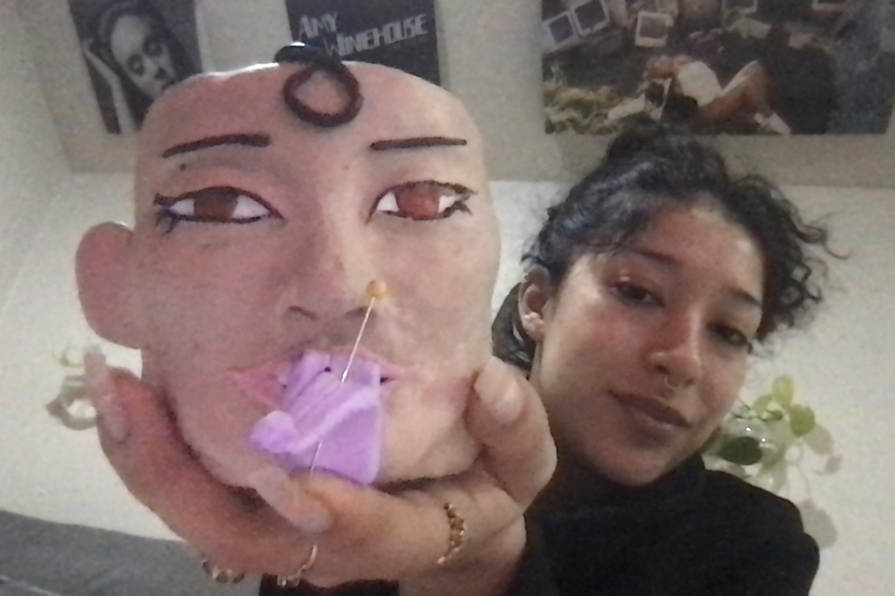

# Clay Making

Sculpting is one of my favorite passtimes. My favorite clay is sculpty clay, as it is malleable, colorful and iconic. I like to use the colored clay, rather than paint over it, for a more cartoon-like finish.
#  Why Clay
1. its cooler than 2D art
2. you can actually use your creations
3. its meditative

#  Materials
1. clay - **Sculpey** is the brand i prefer. 
2. wire for support
3. carving tools (anything that will make you more precise or create the texture you'd like)
4. a regular shmegular oven

#  Some of My Creations

# [A Step by Step](https://www.tiktok.com/t/ZT8EaSncx/)
